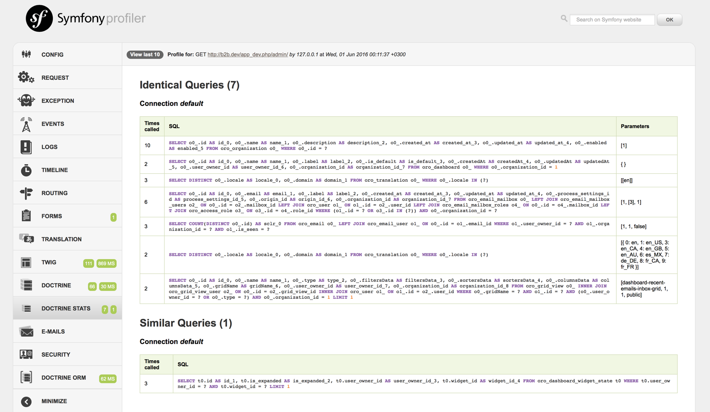

# SensioLabsDoctrineQueryStatisticsBundle

## About

This bundle adds a tab to your Profiler which gathers statistical information about the Doctrine queries that have
been executed during a request.

Right now the bundle generates statistical information about:

- Duplicate queries
- Similar queries (same queries with different parameters)

## License

Released under the MIT License, see LICENSE.